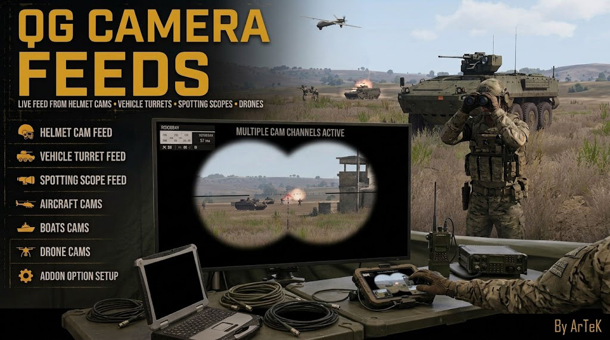
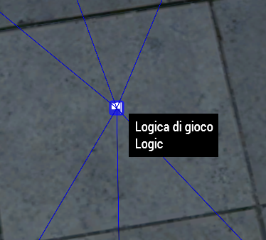
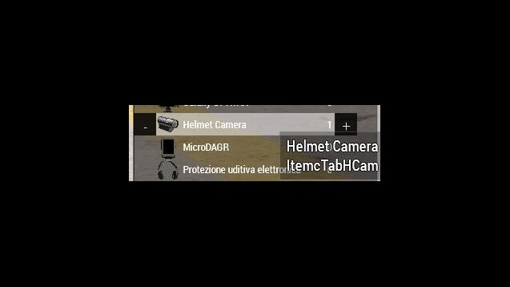
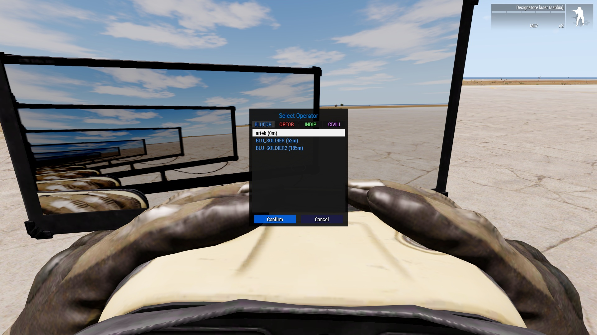
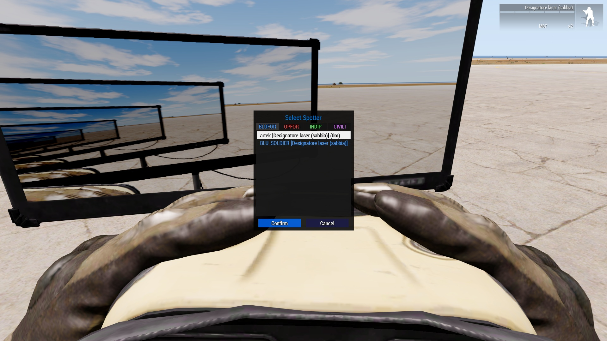
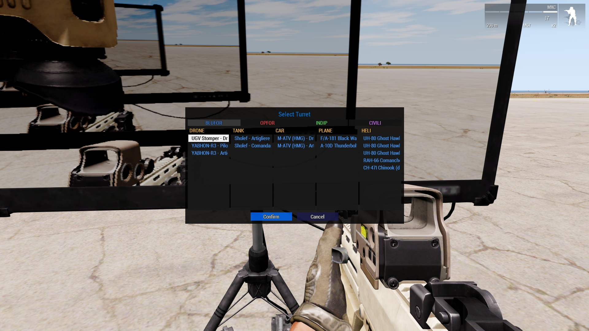
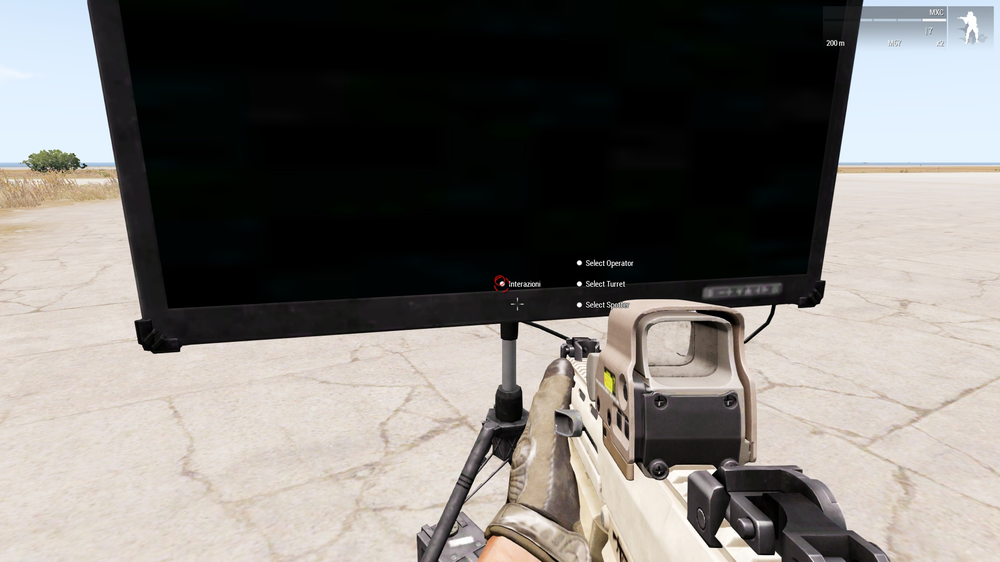
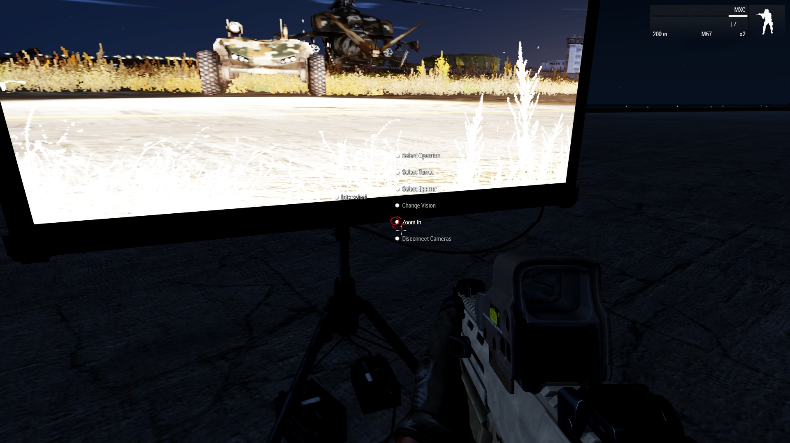
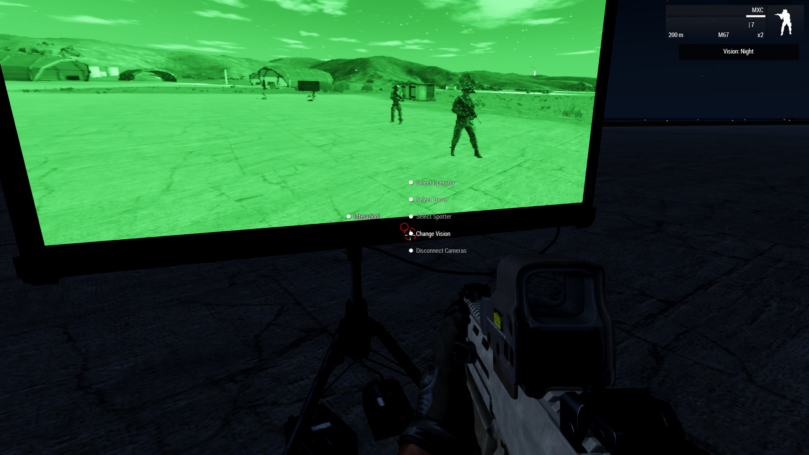

# QG_ArTeK_Camera_Feeds



Sistema di monitor in gioco per ARMA 3. Piazzi degli schermi in una postazione comando e da lì guardi, in tempo reale, quello che vedono le telecamere da casco dei tuoi uomini, le torrette dei mezzi e i droni, oppure l'ottica di uno spotter appostato.

Il video viene renderizzato in un render target e applicato come texture sullo schermo dell'oggetto: è a tutti gli effetti un monitor acceso dentro il mondo di gioco, visibile a chiunque ci passi davanti.

---

## Indice

- [Requisiti](#requisiti)
- [Installazione](#installazione)
- [Le tre sorgenti](#le-tre-sorgenti)
  - [Operator Cam](#operator-cam)
  - [Spotter](#spotter)
  - [Torrette e mezzi](#torrette-e-mezzi)
- [Il menu del monitor](#il-menu-del-monitor)
- [La finestra di selezione](#la-finestra-di-selezione)
- [Permessi](#permessi)
  - [1. Quali sorgenti esistono](#1-quali-sorgenti-esistono)
  - [2. Quali fazioni](#2-quali-fazioni)
  - [3. Mezzi: categoria per fazione](#3-mezzi-categoria-per-fazione)
  - [4. Quali posti dentro al mezzo](#4-quali-posti-dentro-al-mezzo)
  - [5. Operatori e spotter: fazione e IA/player](#5-operatori-e-spotter-fazione-e-iaplayer)
  - [6. Quali ottiche valgono come spotter](#6-quali-ottiche-valgono-come-spotter)
  - [Ordine di precedenza](#ordine-di-precedenza)
- [Qualità dell'immagine](#qualità-dellimmagine)
- [Zoom e visione](#zoom-e-visione)
- [Riferimento completo delle impostazioni](#riferimento-completo-delle-impostazioni)
- [Diagnostica](#diagnostica)
- [Multiplayer e prestazioni](#multiplayer-e-prestazioni)
- [Limiti noti](#limiti-noti)

---

## Requisiti

| Mod | Necessità | Perché |
|---|---|---|
| **CBA_A3** | obbligatorio | dipendenza di cTab, e `CBA_fnc_getFov` misura lo zoom dell'operatore |
| **cTab** | obbligatorio | l'oggetto `ItemcTabHCam` e la funzione `cTab_fnc_checkGear` sono usati per riconoscere gli operatori |
| **ACE3** | opzionale | se presente il menu usa l'interazione ACE, altrimenti ripiega su `addAction` |

Senza cTab il sistema non parte correttamente: la ricerca degli operatori chiama `cTab_fnc_checkGear`.

**Impostazione video obbligatoria:** ogni giocatore deve avere il **PiP** abilitato nelle opzioni video. Con il PiP disattivato i monitor restano neri. La qualità del PiP determina anche la risoluzione reale a cui il gioco disegna il feed — vedi [Qualità dell'immagine](#qualità-dellimmagine).

---

## Installazione

Lo script è un unico file `.sqf` che va incollato **nel campo init di un oggetto** in Eden.

1. Piazza un oggetto qualsiasi che faccia da centralina: va benissimo un **Game Logic** (Entità → Logic Entities → Objects → Logic).
2. Piazza i **monitor**. Serve un oggetto il cui schermo sia la prima selezione texture, per esempio `Land_TripodScreen_01_large_F` o `Land_TripodScreen_01_small_F`.
3. **Sincronizza** ogni monitor alla centralina (tasto `F5` in Eden, poi trascina dalla centralina al monitor).
4. Apri l'init della centralina e incolla dentro tutto il contenuto del file.



*La centralina in Eden, con le linee di sincronizzazione verso i monitor.*

All'avvio i monitor sincronizzati vengono presi da `synchronizedObjects this`, rinominati automaticamente `ARTEK_monitor_0`, `ARTEK_monitor_1` e così via, e ricevono il menu di interazione.

> Un oggetto non sincronizzato alla centralina non riceve niente. Se il menu non compare, il primo controllo è la sincronizzazione.

### Quanti monitor

`_rt_slots` (default `4`) è il numero di render target distinti disponibili. Dal quinto monitor in poi si riciclano i render target già assegnati e due schermi si rubano l'immagine a vicenda. Alzarlo si può, ma ogni render target acceso è una scena in più renderizzata a ogni frame: due o tre monitor accesi contemporaneamente sono già un carico serio.

I render target sono assegnati dal server, uno per monitor, nell'ordine in cui gli schermi sono stati sincronizzati, e i client si limitano a leggere il valore: nessuna macchina può ritrovarsi in disaccordo con le altre su chi occupa cosa.

`_rt_base` (default `0`) sposta l'intero blocco. I nomi dei render target sono condivisi con tutto quello che gira nel gioco, quindi se un'altra mod occupa già i primi slot — cTAB Advanced, per dirne una, sta su 8, 9, 12 e 13 — basta puntare la base su un numero libero e i monitor si spostano tutti insieme.

---

## Le tre sorgenti

### Operator Cam

Riproduce la **telecamera da casco** di un'unità.

**Cosa serve avere:** l'oggetto **`ItemcTabHCam`** nell'inventario dell'unità da riprendere. È un item di cTab: si mette in uniforme, giubbotto o zaino dall'arsenale, cercando la helmet cam fra gli oggetti.

Non serve tenerlo in mano né attivarlo: basta che sia addosso. L'unità compare nella lista finché ce l'ha; se lo perde o muore, il feed si stacca da solo.



*L'oggetto da cercare nell'arsenale: Helmet Camera, classe `ItemcTabHCam`.*



*La lista degli operatori, divisa in schede per fazione.*

La camera è agganciata alla testa dell'unità con un piccolo scostamento, regolabile con `_helmet_cam_offset`, `_helmet_cam_pitch`, `_helmet_cam_yaw`, `_helmet_cam_roll` e `_helmet_cam_fov`. Non ha zoom: riprende con un campo visivo fisso, come una action cam.

### Spotter

Riproduce **quello che l'unità sta guardando attraverso la sua ottica**: stessa direzione, stesso ingrandimento.

**Cosa serve avere:** un'ottica riconosciuta, e va tenuta **in mano**. Il controllo è su `currentWeapon`, quindi l'unità compare nella lista solo mentre ha il binocolo o il designatore imbracciato. Se torna al fucile sparisce dalla lista, e se lo fa a feed acceso il feed si stacca.

Sono riconosciuti:

- tutte le classi elencate in `_spotter_optics`;
- con `_spotter_any_binocular = true` (default), **qualunque oggetto di tipo binocolo**, cioè con `type = 4096` in `CfgWeapons`. Questo comprende binocolo, telemetro, tutti i designatori laser e le loro varianti moddate, senza bisogno di scrivere le classi a mano.

Cosa vedi sul monitor: l'inquadratura e l'ingrandimento reali dell'ottica. Non vedi la cornice nera con il reticolo — quella è interfaccia disegnata sullo schermo del giocatore, non fa parte della scena 3D e non può entrare in un render target.

La camera viene spostata in avanti di `_spotter_cam_forward` metri (default `0.35`) lungo la direzione di vista, per uscire dalla testa e dalle mani di chi imbraccia. Se ti resta qualche dito in quadro, alza il valore a `0.5`.



*Accanto al nome compare l'ottica che l'unità ha in mano.*

### Torrette e mezzi

Riproduce quello che inquadra **una torretta**, o il posto di guida dove ha senso.

**Cosa serve avere:** niente di particolare addosso. Conta il mezzo: deve essere di una categoria abilitata, di una fazione abilitata, e soddisfare la regola sull'equipaggio.

Le categorie riconosciute sono sei più una:

| Categoria | Cosa comprende |
|---|---|
| `drone` | qualunque mezzo `unitIsUAV`, aereo o terrestre che sia |
| `plane` | aerei ad ala fissa |
| `heli` | elicotteri |
| `tank` | cingolati e APC pesanti |
| `car` | ruotati, MRAP, quad |
| `boat` | mezzi navali e anfibi |
| `static` | postazioni fisse (default spento) |

Il test dei droni viene fatto **per primo**, quindi un UGV resta un drone e non finisce fra i ruotati.



*Schede per fazione, e dentro ogni scheda una colonna per categoria di mezzo.*

---

## Il menu del monitor

Con ACE installato le voci stanno nel menu di interazione dell'**oggetto**: punta il monitor e tieni premuto il tasto di interazione (`Win` di default). Non è nell'auto-interazione.

Senza ACE le stesse voci sono nel menu della rotellina.



*A monitor spento restano solo le tre voci di selezione.*

| Voce | Quando compare |
|---|---|
| **Select Operator** | sempre, se `_feed_operator` è attivo |
| **Select Turret** | sempre, se `_feed_turret` è attivo |
| **Select Spotter** | sempre, se `_feed_spotter` è attivo |
| **Change Vision** | a feed acceso |
| **Zoom In** / **Zoom Out** | solo a feed torretta acceso, e solo se lo scatto in quella direzione esiste |
| **Disconnect Camera** | a feed acceso |

Le tre voci di selezione sono disponibili **anche a feed già acceso**: scegliere una nuova sorgente stacca la precedente e attacca la nuova da sola. Non serve disconnettere prima, e si può passare direttamente da un tipo all'altro.

---

## La finestra di selezione

La finestra è divisa in **schede per fazione**. Le schede esistono solo per le fazioni abilitate, più sempre la tua.

- **Select Turret** apre la finestra larga: dentro ogni scheda c'è una **colonna per categoria** di mezzo, ordinate come le righe di `_veh_rules`. Le categorie senza mezzi in quella fazione non vengono disegnate, quindi le colonne restano larghe.
- **Select Operator** e **Select Spotter** aprono la finestra stretta con una lista singola.

Le righe sono colorate per fazione secondo `_side_colors`. Il colore è ridondante rispetto alla scheda, ma è il tuo controllo visivo gratuito: se una riga esce del colore sbagliato, sai che il rilevamento del lato sta leggendo male.

Una scheda abilitata ma vuota mostra il messaggio `_string_tab_empty` invece di sparire, così distingui "non c'è niente" da "il filtro lo sta scartando".

Cambiando scheda la selezione si azzera e si posiziona sulla prima voce disponibile.

---

## Permessi

Stanno **tutti nelle prime 32 righe del file**, in blocchi separati da una riga vuota. Sotto ci sono solo estetica e meccanica della camera.

I permessi sono a livelli: un livello più alto spento rende irrilevanti quelli sotto.

### 1. Quali sorgenti esistono

```sqf
private _feed_operator = true;
private _feed_turret   = true;
private _feed_spotter  = true;
```

Accendono e spengono le tre voci del menu. **Sono il livello più alto**: con tutti e tre a `false` il monitor non ha nessuna voce e il resto della configurazione non viene nemmeno letto.

### 2. Quali fazioni

```sqf
private _show_additional_sides = [["blufor", true], ["opfor", true], ["independent", true], ["civilian", true]];
```

Decide quali **schede** esistono nella finestra di selezione.

> Si chiama *additional* perché sono le fazioni **in più** rispetto alla tua. La tua fazione è sempre visibile, anche mettendo tutto a `false`.

### 3. Mezzi: categoria per fazione

```sqf
private _rule_sides = ["west", "east", "guer", "civ"];
private _veh_rules = [
    ["drone",  ["free", "free", "free", "free"]],
    ["tank",   ["any",  "any",  "any",  "any" ]],
    ["car",    ["any",  "any",  "any",  "any" ]],
    ["plane",  ["any",  "any",  "any",  "any" ]],
    ["heli",   ["any",  "any",  "any",  "any" ]],
    ["boat",   ["any",  "any",  "any",  "any" ]],
    ["static", ["hide", "hide", "hide", "hide"]]
];
```

Una matrice: **righe = categoria**, **colonne = fazione**. L'ordine delle colonne è dichiarato in `_rule_sides`, nella riga sopra la tabella: se lo riordini lì, la tabella lo segue.

Ogni cella dice sia se la categoria è attiva per quella fazione, sia che equipaggio serve:

| Valore | Significato |
|---|---|
| `"hide"` | la categoria non compare per quella fazione |
| `"free"` | compare sempre, nessun controllo sull'equipaggio |
| `"any"` | serve qualcuno a bordo, giocatore o IA |
| `"player"` | serve almeno un giocatore a bordo |
| `"ai"` | serve almeno un'IA a bordo |

**Sui droni `"player"` funziona diversamente.** Un drone ha sempre l'IA dentro, quindi controllare l'equipaggio non direbbe niente. Per i droni la regola legge `UAVControl`, cioè chi è collegato al **terminale**: `"player"` significa "c'è un giocatore che lo sta pilotando".

Esempio — aerei blufor solo quando ci vola un giocatore, carri opfor sempre, niente elicotteri civili:

```sqf
["plane", ["player", "any",  "any", "hide"]],
["tank",  ["any",    "free", "any", "hide"]],
["heli",  ["any",    "any",  "any", "hide"]],
```

### 4. Quali posti dentro al mezzo

```sqf
private _turret_filter = "gunner";
private _list_driver_seat = true;
```

`_turret_filter` decide quali postazioni finiscono in lista:

| Valore | Cosa elenca |
|---|---|
| `"gunner"` | solo torrette **armate** — default |
| `"crewed"` | tutte le torrette vere, anche disarmate, ma niente posti passeggero |
| `"all"` | tutto, comprese le postazioni FFV dei passeggeri |

Con `"gunner"` vengono scartati i copiloti (`isCopilot = 1`), i posti FFV e ogni postazione senza armi. **Unica eccezione: i droni**, che spesso hanno una torretta di soli sensori senza armi — su di loro il controllo sull'arma non si applica.

`_list_driver_seat` include il **posto di guida**, che in SQF è il percorso torretta `[-1]`. Serve soprattutto agli aerei: un caccia non ha torrette, il pilota è il driver e le armi sono sue, quindi senza questa opzione gli aerei non comparirebbero affatto. Con `_turret_filter = "gunner"` il posto di guida entra solo se è armato. La voce si chiama `Pilot` sui mezzi aerei e `Driver` sugli altri.

### 5. Operatori e spotter: fazione e IA/player

```sqf
private _operator_rules = ["any", "any", "any", "any"];
private _spotter_rules  = ["any", "any", "any", "any"];
```

Una cella per fazione, stesso ordine di colonne di `_rule_sides`. Sono **due tabelle indipendenti**, lette da due funzioni diverse: puoi farle divergere quanto vuoi.

| Valore | Significato |
|---|---|
| `"hide"` | quella fazione non compare per quella sorgente |
| `"any"` | giocatori e IA |
| `"player"` | solo giocatori |
| `"ai"` | solo IA |

Non c'è `"free"`: su una persona non c'è equipaggio da controllare.

Esempio — helmet cam solo dei giocatori blufor, spotter di chiunque tranne i civili:

```sqf
_operator_rules = ["player", "hide", "hide", "hide"];
_spotter_rules  = ["any",    "any",  "any",  "hide"];
```

### 6. Quali ottiche valgono come spotter

```sqf
private _spotter_optics = [
    "Nikon_DSLR_HUD", "Nikon_DSLR",
    "Hate_Smartphone_HUD", "Hate_Smartphone",
    "Laserdesignator"
];
private _spotter_any_binocular = true;
```

`_spotter_optics` è l'elenco esplicito di classi accettate. `_spotter_any_binocular` aggiunge automaticamente qualunque oggetto di tipo binocolo (`type = 4096`), che copre binocoli, telemetri e designatori anche moddati senza doverli elencare.

Mettendolo a `false` valgono solo le classi scritte a mano.

### Ordine di precedenza

Dal più forte al più debole:

1. `_feed_*` — se la voce di menu non esiste, non esiste niente
2. `_show_additional_sides` — se la fazione non ha scheda, non la vedi
3. le tabelle per sorgente — `_veh_rules`, `_operator_rules`, `_spotter_rules`
4. `_turret_filter` e `_list_driver_seat` — quali posti dentro un mezzo già ammesso
5. `_spotter_optics` — cosa conta come ottica

Spegnere una fazione al punto 2 fa sparire la scheda. Mettere `"hide"` al punto 3 lascia la scheda e la mostra vuota: è voluto, così distingui "questa fazione non la guardo" da "questa fazione la guardo, ma non i suoi spotter".

---

## Qualità dell'immagine

```sqf
private _rt_width  = 2048;
private _rt_height = 2048;
private _rt_aspect = 1.777;
private _disable_dof = true;
```

`_rt_width` e `_rt_height` sono le dimensioni della texture del render target. **Devono essere potenze di due**: il motore rifiuta valori come 1920 o 1080 con un errore *Cannot load texture* e il monitor resta nero. Il codice arrotonda comunque alla potenza di due superiore, con tetto a 2048, quindi anche sbagliando il valore il feed parte.

Ne consegue che un 16:9 esatto nella texture non è ottenibile. `_rt_aspect` è il rapporto con cui il motore **inquadra** la scena (`1.777` = 16:9, `1.333` = 4:3, `1.0` = quadrato) ed è indipendente dalla forma della texture. L'alternativa più vicina al 16:9 fra le potenze di due è `2048 × 1024`, che dimezza anche la memoria per monitor.

`_disable_dof` a `true` spegne la profondità di campo sul feed: tutta la scena resta a fuoco e l'immagine è più incisa.

> **Il tetto vero è l'impostazione PiP nelle opzioni video del gioco.** Governa la risoluzione a cui il motore renderizza davvero i render target e sta sopra a qualunque numero scritto qui. Se il feed è sgranato, la prima cosa da guardare è quella — ed è per giocatore, quindi su un server ognuno vede la sua qualità.

Nota sui modelli: il PiP disegna con livelli di dettaglio ridotti. Un oggetto grosso a mezzo metro dall'obiettivo esce squadrato, e non è un problema di risoluzione — non si aggiusta alzando i numeri.

---

## Zoom e visione

```sqf
private _turret_zoom_steps = [0.25, 0.05, 0.0167];
private _turret_zoom_names = ["Wide", "Medium", "Narrow"];
private _turret_zoom_default = 0;
```

Tre scatti discreti, presi dai pod di puntamento reali (30/120, 6/120, 2/120). Valgono **solo sul feed dei mezzi**: la helmet cam non zooma per scelta, e lo spotter segue già l'ingrandimento della sua ottica.

L'array è ordinato dal più largo al più stretto: indice che sale vuol dire stringere. Lo zoom non cicla, si ferma agli estremi, e le voci di menu compaiono solo quando lo scatto in quella direzione esiste.



*Allo scatto più largo compare solo Zoom In: Zoom Out appare da Medium in poi.*

### Rispecchiare lo zoom dell'operatore

```sqf
private _follow_operator_zoom = true;
private _operator_fov_step = 0.004;
private _operator_fov_interval = 0.15;
private _operator_fov_scale = 1;
```

Quando c'è un **giocatore** che sta guardando attraverso il mezzo — seduto in torretta, oppure collegato a un drone dal terminale UAV — il feed riproduce il suo zoom invece degli scatti fissi. Collegandosi a quella torretta si parte esattamente dalla sua inquadratura, e i tre scatti diventano relativi: il primo è quello che vede lui, gli altri due possono solo stringere. Più largo dell'operatore il monitor non va.

Il campo visivo è misurabile solo sulla macchina che sta disegnando quella vista, quindi lo misura il client dell'operatore e lo pubblica sul mezzo, e i monitor lo leggono da lì. La misura viene presa ogni `_operator_fov_interval` secondi e spedita solo quando si sposta di più di `_operator_fov_step`, così un feed fermo non genera traffico.

L'ultimo valore resta sul mezzo anche dopo che l'operatore ha lasciato la postazione: zoomi nel FLIR di un drone, torni alla postazione comando e trovi il monitor inquadrato come l'hai lasciato. Se invece nessuno sta guardando attraverso il mezzo — artigliere IA, drone senza nessuno al terminale — non c'è niente da rispecchiare e tornano gli scatti fissi.

`_operator_fov_scale` (default `1`) moltiplica il valore rispecchiato, per quando il feed esce sistematicamente più largo o più stretto di quello che vede davvero l'operatore. `_follow_operator_zoom = false` spegne tutto e lascia il comando agli scatti fissi.

### Modalità di visione

```sqf
private _vision_modes = [
    ["Normal", [0]],
    ["Night",  [1]]
];
```

Ogni voce è `[nome mostrato, array passato a setPiPEffect]`. `Change Vision` cicla la tabella, e il cambio è **propagato a tutti i client**: senza quello l'effetto varrebbe solo per chi preme.

`setPiPEffect` applica **un effetto per volta**, non si impilano. Indici disponibili:



*Change Vision cicla la tabella, e il cambio vale per tutti i client.*

| Indice | Effetto |
|---|---|
| `0` | normale |
| `1` | notturno |
| `2` | termico bianco caldo |
| `3` | correzione colore `[3, acceso, luminosità, contrasto, offset, blend, lerp, pesi]` |
| `4` | specchio |
| `5` | aberrazione cromatica |
| `6` | grana `[6, acceso, intensità, nitidezza, dimensione, i1, i2, mono]` |
| `7` | termico nero caldo |

Righe pronte da aggiungere alla tabella:

```sqf
["Contrast",  [3, 1, 1.05, 1.22, -0.02, [0,0,0,0], [1,1,1,1], [0.299, 0.587, 0.114, 0]]],
["White Hot", [2]],
["Black Hot", [7]]
```

---

## Riferimento completo delle impostazioni

### Permessi

| Variabile | Default | Cosa fa |
|---|---|---|
| `_feed_operator` | `true` | voce Select Operator |
| `_feed_turret` | `true` | voce Select Turret |
| `_feed_spotter` | `true` | voce Select Spotter |
| `_show_additional_sides` | tutte `true` | fazioni oltre la propria |
| `_rule_sides` | `west east guer civ` | ordine colonne delle tabelle |
| `_veh_rules` | vedi sopra | categoria mezzo × fazione |
| `_turret_filter` | `"gunner"` | quali postazioni elencare |
| `_list_driver_seat` | `true` | includere il posto di guida |
| `_operator_rules` | tutte `"any"` | operatori per fazione |
| `_spotter_rules` | tutte `"any"` | spotter per fazione |
| `_spotter_optics` | 5 classi | ottiche accettate |
| `_spotter_any_binocular` | `true` | accetta ogni binocolo |

### Immagine e camera

| Variabile | Default | Cosa fa |
|---|---|---|
| `_rt_width` / `_rt_height` | `2048` | texture del render target, potenze di due |
| `_rt_aspect` | `1.777` | rapporto di inquadratura |
| `_rt_slots` | `4` | render target distinti disponibili |
| `_rt_base` | `0` | primo render target usato, sposta tutto il blocco |
| `_disable_dof` | `true` | spegne la profondità di campo |
| `_turret_zoom_steps` | `0.25 0.05 0.0167` | scatti di zoom delle torrette |
| `_turret_zoom_names` | `Wide Medium Narrow` | etichette degli scatti |
| `_turret_zoom_default` | `0` | scatto all'accensione |
| `_follow_operator_zoom` | `true` | rispecchia lo zoom dell'operatore sui feed dei mezzi |
| `_operator_fov_step` | `0.004` | di quanto deve spostarsi lo zoom prima di essere pubblicato |
| `_operator_fov_interval` | `0.15` | secondi fra una misura e l'altra |
| `_operator_fov_scale` | `1` | moltiplicatore sullo zoom rispecchiato |
| `_vision_modes` | `Normal`, `Night` | modalità di visione |
| `_helmet_cam_offset` | `[0.2, 0, 0.175]` | scostamento camera da casco |
| `_helmet_cam_pitch` / `_yaw` / `_roll` | `0` | orientamento camera da casco |
| `_helmet_cam_fov` | `0.87` | campo visivo camera da casco |
| `_spotter_cam_forward` | `0.35` | avanzamento camera spotter, in metri |

### Interfaccia

| Variabile | Default | Cosa fa |
|---|---|---|
| `_use_ace_interaction` | `true` | usa ACE se presente |
| `_show_group` / `_show_group_number` | `false` | mostra gruppo e numero nelle liste |
| `_show_distance` | `true` | mostra la distanza nelle liste |
| `_side_colors` | 4 tinte | colore righe per fazione |
| `_ui_color_group_rgba` | ambra | colore intestazioni di colonna |
| `_string_side_*` | `BLUFOR` ecc. | nomi delle schede |
| `_string_tab_empty` | `Nothing available` | messaggio scheda vuota |
| `_string_pilot_seat` / `_string_driver_seat` | `Pilot` / `Driver` | nome del posto di guida |
| `_string_change_vision` | `Change Vision` | etichetta voce visione |
| `_string_zoom_in` / `_string_zoom_out` | `Zoom In` / `Zoom Out` | etichette zoom |

### Diagnostica

| Variabile | Default | Cosa fa |
|---|---|---|
| `_spotter_fov_debug` | `false` | scrive nel .rpt i valori di zoom dello spotter |
| `_operator_fov_debug` | `false` | scrive lo zoom rispecchiato in chat di sistema e nel .rpt |

---

## Diagnostica

All'avvio, nel `.rpt`:

```
[QG_ArTeK_Camera_Feeds] versione 4.13
```

Se non la vedi, lo script non sta girando. Se vedi un numero diverso da quello che ti aspetti, stai caricando un file vecchio.

Subito dopo, una riga per monitor con il render target assegnato:

```
[QG_ArTeK_Camera_Feeds] monitor 0 render target 0
[QG_ArTeK_Camera_Feeds] init monitor ARTEK_monitor_0 su rendertarget0
```

Due schermi sullo stesso numero vuol dire che condividono il render target e si ruberanno l'immagine: alza `_rt_slots`, oppure sposta il blocco con `_rt_base` se di mezzo c'è un'altra mod.

A missione avviata, al primo giro del rispecchiamento dello zoom:

```
[QG_ArTeK_Camera_Feeds] publisher FOV attivo, versione 4.13
```

Alla prima accensione di un feed:

```
[QG_ArTeK_Camera_Feeds] render target #(argb,2048,2048,1)r2t(rendertarget0,1.777) | PiP abilitato true
```

Conferma la risoluzione che sta arrivando davvero al motore, dopo l'arrotondamento a potenza di due, e se il PiP è attivo.

Con `_spotter_fov_debug = true`, a feed spotter acceso:

```
[QG_ArTeK_Camera_Feeds] spotter Rossi arma Laserdesignator getObjectFOV 0.42 usato 0.42 (live)
```

Viene scritta solo quando il valore cambia, quindi non intasa il log.

Con `_operator_fov_debug = true`, mentre sei tu a guardare attraverso un mezzo, la chat di sistema riporta quello che viene pubblicato:

```
[ArTeK] B_UAV_02_dynamicLoadout_F terminale ARTEK_fov_[0] FOV 0.0429 [cba]
```

Da sinistra a destra: il mezzo, come sei stato riconosciuto (`terminale` dal terminale UAV, `posto` da una postazione), la variabile sotto cui viene pubblicato il valore, il campo visivo misurato e da dove arriva la misura (`cba` o `obj`). Tutto quello che sta fuori da 0.005–1.6 viene scartato e non arriva mai al monitor.

### Se qualcosa non va

| Sintomo | Da guardare |
|---|---|
| nessuna voce nel menu | monitor sincronizzato alla centralina? `_feed_*` accesi? stai puntando il monitor e non usando l'auto-interazione? |
| monitor nero | PiP abilitato nelle opzioni video? |
| *Cannot load texture* | `_rt_width` / `_rt_height` non sono potenze di due |
| la lista è vuota | fazione abilitata? cella della tabella non su `"hide"`? l'unità ha l'oggetto giusto **in mano** (spotter) o **addosso** (operatore)? |
| gli aerei non compaiono | `_list_driver_seat` a `true`: un aereo non ha torrette |
| la lista è lunghissima | `_turret_filter` su `"all"` include tutti i posti passeggero; passa a `"gunner"` |
| immagine sgranata | impostazione PiP nelle opzioni video |
| il monitor non segue lo zoom dell'operatore | `_follow_operator_zoom` è acceso? c'è davvero un **giocatore** che guarda attraverso quel mezzo? con un artigliere IA non c'è niente da rispecchiare |

---

## Multiplayer e prestazioni

Sul **server dedicato** il costo è nullo: le camere e il gestore per frame vengono creati solo su macchine con interfaccia. Il server imposta le variabili e la texture, e si ferma lì.

Il costo è sui **client**, ed è un render di scena completo per ogni feed acceso, a ogni frame. Due monitor accesi sono due scene in più.

---

## Limiti noti

**Il feed lo renderizzano tutti.** L'accensione viene propagata a ogni macchina, quindi ogni giocatore collegato crea la sua camera e paga il render — anche chi è a chilometri di distanza e non vedrà mai quel monitor. Con pochi giocatori non si nota, su un server pieno è un costo distribuito su tutti per un'immagine che interessa a due persone.

**Chi entra a partita in corso non vede il feed.** Riceve il menu ma non la camera, perché l'accensione sulla sua macchina non è mai girata: vede il monitor nero finché qualcuno non riseleziona la sorgente.

**Traffico ridondante all'accensione.** L'accensione gira su ogni macchina e ognuna ripete le stesse chiamate globali e pubbliche. Non rompe niente, ma è traffico evitabile.

**La cornice dell'ottica non entra nel feed.** Reticolo, maschera nera e letture del designatore sono interfaccia disegnata sullo schermo del giocatore, non geometria della scena: un render target renderizza solo la scena 3D. Il feed riproduce inquadratura e ingrandimento, non la grafica dell'ottica.

**Un oggetto molto vicino all'obiettivo esce squadrato**, perché il PiP usa livelli di dettaglio ridotti. Non dipende dalla risoluzione.

**Si può rispecchiare solo lo zoom di un giocatore.** Il campo visivo è misurato sulla macchina che disegna quella vista, quindi una torretta in mano all'IA non pubblica niente e il feed ripiega sugli scatti fissi.
